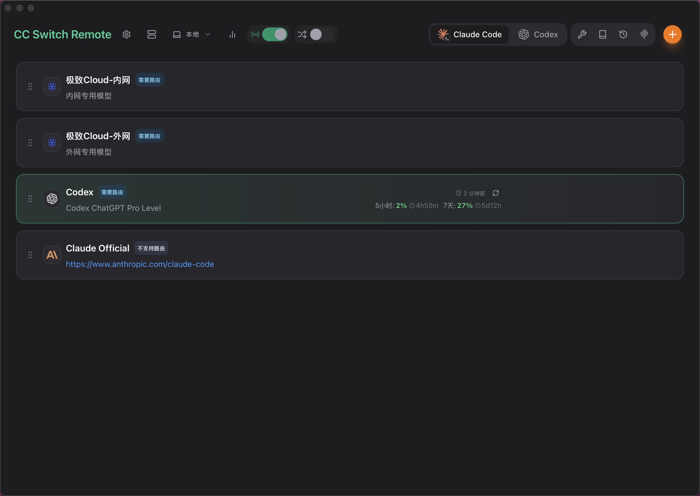

<div align="center">

# CC Switch Remote

### 本地与远程服务器并行管理的 AI 编程工具控制台

[](https://github.com/xiaoY233/cc-switch-remote/releases)
[](https://github.com/xiaoY233/cc-switch-remote/releases)
[](https://tauri.app/)
[](https://github.com/xiaoY233/cc-switch-remote/releases/latest)

CC Switch Remote 是基于 CC Switch 的远程管理增强版本。它保留本地桌面管理体验，同时增加独立的远程服务器目标：本地配置留在本机，远程配置留在远程主机，桌面端通过 SSH 调用远程 Rust Helper 执行真实管理动作。

[下载最新版](https://github.com/xiaoY233/cc-switch-remote/releases/latest) | [更新日志](CHANGELOG.md) | [用户手册](docs/user-manual/zh/README.md) | [远程功能对齐表](docs/remote-feature-parity.md) | [English](README.md)



</div>

## 项目定位

- `main` 是 CC Switch Remote 产品主线，用于远程管理迭代和正式发布。
- `upstream-main` 用于同步上游 `farion1231/cc-switch/main`，不直接作为发布分支。
- 本地管理和远程管理是两个独立目标。本地状态保存在本机 CC Switch 数据目录；远程状态保存在选中的远程主机。
- 远程操作通过 SSH 调用 `cc-switch-remote-helper`，Helper 在远程主机上读取和写入该主机自己的供应商、设置、MCP、Prompts、Skills、工具配置和数据库。
- 桌面端只保存远程连接配置、连接密钥和健康检查缓存，不把本地 JSON 或本地数据库当作远程主机的数据源。

## 核心能力

- 管理 Claude Code、Codex、Gemini CLI、OpenCode、OpenClaw、Claude Desktop、Hermes 等工具的供应商配置。
- 支持本地和远程目标切换，同一套页面尽量复用本地组件和交互。
- 支持远程供应商管理、远程统一供应商、远程路由、自动故障转移、整流器、全局出站代理、认证、工具环境检查、MCP、Prompts、Skills、会话、Hermes Memory、OpenClaw、导入导出、备份恢复和云同步。
- 远程 Helper 独立发布，目标主机不需要安装桌面环境或 GTK/WebKit 依赖。
- 保留上游本地功能同步能力，远程能力通过 target adapter、Helper command 和共享 Rust service 逐步对齐。

## 远程管理使用流程

1. 在左侧进入“远程服务器”，添加远程主机连接信息。
2. 对目标主机执行健康检查，安装或更新远程 Helper。
3. 在顶部目标切换器中从“本地”切换到远程主机。
4. 进入供应商、设置、MCP、Prompts、Skills、会话、工具环境等页面，操作会作用在当前远程主机。
5. 如果 Helper 能力不足，页面会提示需要更新 Helper；不要把低级命令错误当成可用功能。

远程管理设计原则：

- 远程供应商 API Key 和配置文件保存在远程主机，不写入本机数据库。
- 本地与远程不会自动互相覆盖。导入、导出、备份、恢复都需要用户显式触发。
- 不支持远程安全语义的本地能力会隐藏、禁用或说明原因，例如本地托盘、桌面深链、本地应用更新、本地终端启动、本机 UI 语言主题等。
- 远程命令失败不应关闭已有运行态，除非 SSH transport 或 Helper session 本身不可用。

## 远程 Helper

远程 Helper 是运行在远程主机上的纯 CLI Rust 二进制：

- Release tag: [`remote-helper-latest`](https://github.com/xiaoY233/cc-switch-remote/releases/tag/remote-helper-latest)
- Asset 前缀：`cc-switch-remote-helper-*`
- 支持目标：Linux x86_64、Linux arm64、macOS universal
- 构建方式：`--no-default-features`，不依赖 Tauri 桌面运行库

推荐通过应用内“远程服务器”页面安装和更新 Helper。手动排查时，可在远程主机上检查：

```bash
~/.local/bin/cc-switch-remote-helper --version
~/.local/bin/cc-switch-remote-helper --json status
```

## 下载

前往 [GitHub Releases](https://github.com/xiaoY233/cc-switch-remote/releases/latest) 下载最新桌面应用。

### Windows

- `CC-Switch-Remote-v{version}-Windows.msi`
- `CC-Switch-Remote-v{version}-Windows-Portable.zip`

### macOS

- `CC-Switch-Remote-v{version}-macOS.dmg`
- `CC-Switch-Remote-v{version}-macOS.zip`

当前 macOS 构建未使用 Apple Developer ID 签名和公证，首次打开可能需要在系统设置中手动允许。

### Linux

- `CC-Switch-Remote-v{version}-Linux-x86_64.AppImage`
- `CC-Switch-Remote-v{version}-Linux-arm64.AppImage`
- `CC-Switch-Remote-v{version}-Linux-x86_64.deb`
- `CC-Switch-Remote-v{version}-Linux-arm64.deb`
- `CC-Switch-Remote-v{version}-Linux-x86_64.rpm`
- `CC-Switch-Remote-v{version}-Linux-arm64.rpm`

`.tar.gz` 资产主要用于 Tauri updater 自动更新，普通用户通常不需要手动下载。

## 数据与目录

本地数据默认位于本机：

- 数据库：`~/.cc-switch/cc-switch.db`
- 设置：`~/.cc-switch/settings.json`
- 备份：`~/.cc-switch/backups/`
- Skills：`~/.cc-switch/skills/`

远程数据位于远程主机，由 Helper 读取和写入。桌面端不会把本机数据当成远程主机的源数据。

## 版本与发布模型

桌面应用和远程 Helper 分开发版：

- 应用版本通过 `v*` tag 触发正式发布。
- Helper 通过 `Remote Helper Artifacts` workflow 发布到 `remote-helper-latest`。
- `CHANGELOG.md` 和 `docs/release-notes/` 会写明远程版版本、上游基线和 Helper 发布说明。
- 当前远程版延续 `3.16.x` 应用版本号，以保证已经发布过的用户可以通过 Tauri updater 正常升级；上游基线会在 release note 中单独说明。

完整版本发布前建议检查：

1. `main` 已包含最终代码和文档。
2. `remote-helper-latest` 已由最终 commit 构建。
3. 桌面应用 release workflow 成功生成各平台资产。
4. `latest.json` 包含需要自动更新的平台和签名。
5. Release note 已包含真实更新内容，而不是只有下载说明。

## 开发

### 环境要求

- Node.js 20+
- pnpm
- Rust stable
- Tauri 2

### 常用命令

```bash
pnpm install
pnpm dev
pnpm exec tsc --noEmit
pnpm build
```

### Rust 检查

```bash
cargo fmt --manifest-path src-tauri/Cargo.toml --check
cargo test --manifest-path src-tauri/Cargo.toml
cargo check --manifest-path src-tauri/Cargo.toml --bin cc-switch-remote-helper --no-default-features
```

### 远程相关测试

```bash
cargo test --manifest-path src-tauri/Cargo.toml remote::tests
cargo test --manifest-path src-tauri/Cargo.toml --test remote_ssh
pnpm vitest run src/lib/query/remote.test.ts tests/components/RemoteSettingsPage.test.tsx
```

## 文档

- [中文用户手册](docs/user-manual/zh/README.md)
- [远程服务器管理指南](docs/guides/remote-server-management-zh.md)
- [远程功能对齐表](docs/remote-feature-parity.md)
- [v3.16.9 发布说明](docs/release-notes/v3.16.9-zh.md)
- [更新日志](CHANGELOG.md)

## 上游同步

本项目不是给上游提交 PR 的分支。目标是把 CC Switch Remote 作为独立产品主线，同时通过 `upstream-main` 周期性同步上游功能。

远程相关代码应尽量集中在 remote adapter、Helper command、target-aware hooks 和共享 Rust service 中，减少与上游本地页面和业务逻辑的冲突。

## License

MIT
